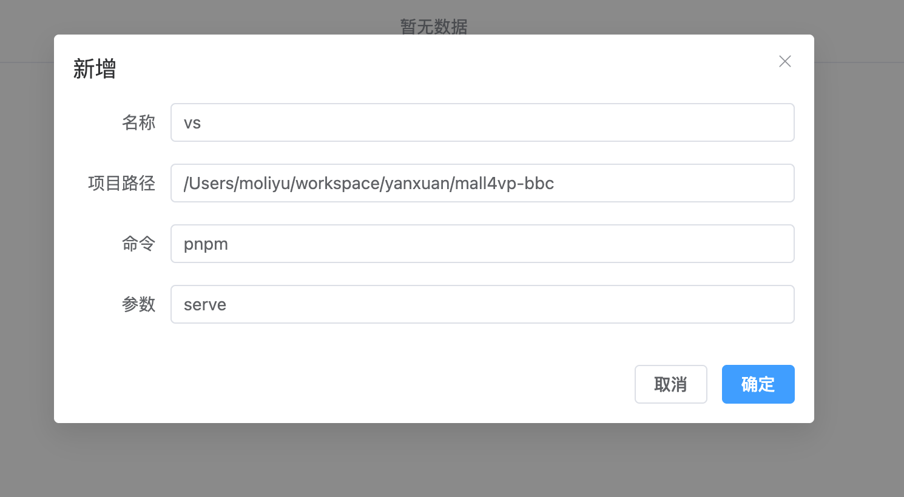

### Description

#### this is a project which can manger your shell process with nodejs espcially node process. you can manage your node project in a same terminal.

### How to use

1. install

```
npm install @moliyu/process-monitor -g
```

2. run with `monitor`, and visited `loalhost:4000`

### screenshots


